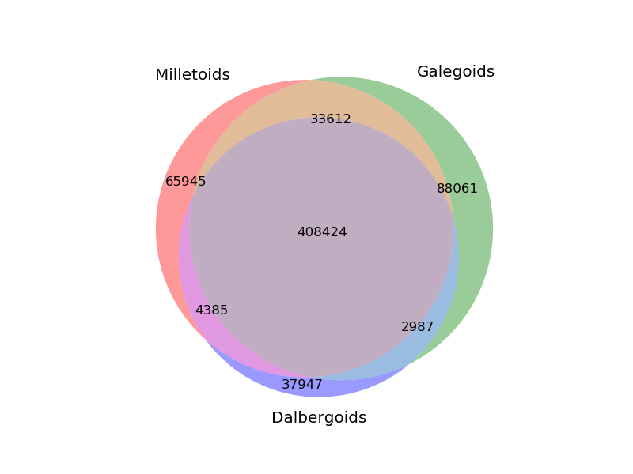
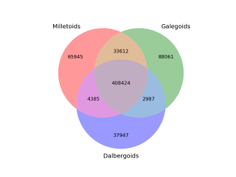

# orthomclToVenn

I could not find a script that takes the output from OrthoMCL, gives you the number of genes in shared clusters between groups, includes the number of genes that are not in clusters, and then makes a Venn diagram, so I made one. I first used https://github.com/apetkau/orthomcl-pipeline but that one prints shared clusters only and does not care about singletons not in any clusters.

WARNING: Currently this script is extremely untested, and can only make Venn diagrams for 2 or 3 groups. However, it gives you the number of shared genes and clusters so you can plug those into other software which can do 4,5,6, etc. group Venn diagrams.
Currently, the Venn diagram contains only the shared genes, not the shared clusters (this is an easy fix though).


Weighted Venn diagram:



Unweighted Venn diagram:



# Requirements

- python2.7, at least
- python packages: `matplotlib_venn` (`pip install matplotlib_venn`)

# How to run it

## Input files

- groups.txt - this is the output from orthoMCL
- singletons.txt - this file is produced by running orthoMCL's `orthomclSingletons` and contains all genes that are contained in no groups.
- families.txt - this file details which species are in which groups, first the name of the group, then the short handles that appear in groups.txt. Example:

```
Milletoids: Gma,Caj,Vir,Adz,G19,BAT
Galegoids: Lja,Clo,Red,Mtr,Des,Kab
Dalbergoids: Ari,Ard
```

This file does not necessarily need to include all species contained in groups.txt.

## Running it

```
>python2.7 OrthomclToVenn.py -h
usage: OrthomclToVenn.py [-h] groups singletons families figure table

Parses orthomcl groups.txt and singletons, plots a Venn diagram of the number
of genes in shared and non-shared clusters

positional arguments:
    groups      Path to groups.txt
    singletons  Path to singletons file (use orthomclSingletons, part of
    orthomcl)
    families    Path to file detailing groups of species/families - see README
    figure      Output path for final figure of shared genes (add .svg for SVG picture, add .png
                for PNG etc.)
    table       Output path for final table of groups

    optional arguments:
        -h, --help  show this help message and exit
```

So for example:

    python2.7 OrthomclToVenn.py groups.txt singletons.txt dalbergiods_millettoids_galegoids.txt figure.png dalbergiods_millettoids_galegoids_table.csv

It should then print something like:

```
INFO:__main__:Started parsing.
INFO:__main__:Got 14 species in 3 families/groups.
INFO:__main__:Parsing groups.txt.
INFO:__main__:Writing cluster numbers to dalbergiods_millettoids_galegoids_table.csv
INFO:__main__:Also printing cluster numbers here:
INFO:__main__:Group	Genes overlap	Clusters overlap
INFO:__main__:Galegoids:Milletoids	33612	3496
INFO:__main__:Dalbergoids:Galegoids	2987	557
INFO:__main__:Milletoids	65945	8109
INFO:__main__:Dalbergoids:Galegoids:Milletoids	408424	14522
INFO:__main__:Galegoids	88061	10970
INFO:__main__:Dalbergoids	37947	4033
INFO:__main__:Dalbergoids:Milletoids	4385	527
INFO:__main__:Plotting unweighted Venn diagram to figure_unweighted.png and weighted Venn diagram to figure_weighted.png
```

The table it prints out is also contained in `dalbergiods_millettoids_galegoids_table.csv` in case you already have your Venn diagrams and only need the numbers. Two figures will be created: one is weighted (where the size of the circle is relational to the number of genes in it) and one is un-weighted (where the size of the circle is always the same).

# What it does

It collects the species that occur in each of the groups reported by OrthoMCL. If all genes in the group belong to only one of the user-supplied families then all genes in that cluster belong to that one family. If genes from species that appear in two families are in that cluster, then all genes in that cluster are shared between the two families, etc. pp. As the last step it will count all genes not in any OrthoMCL groups and will add them to the relevant families, these genes can't be shared.

# TODO

- Currently, `matplotlib_venn` only supports venn2 and venn3, no venn4,5,6,7... It also does not support the famous Banana Venn.
- add tests :(
- add test data
